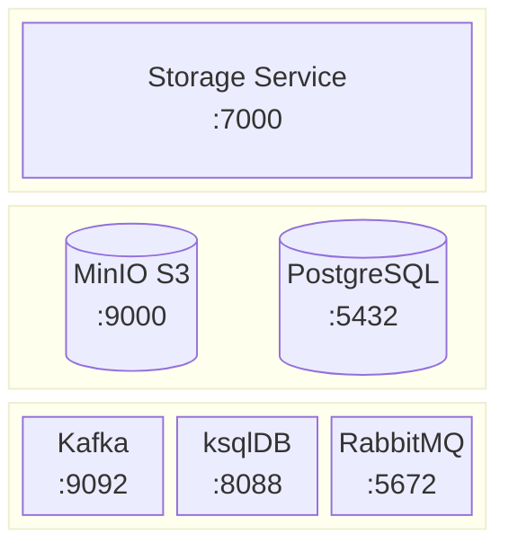
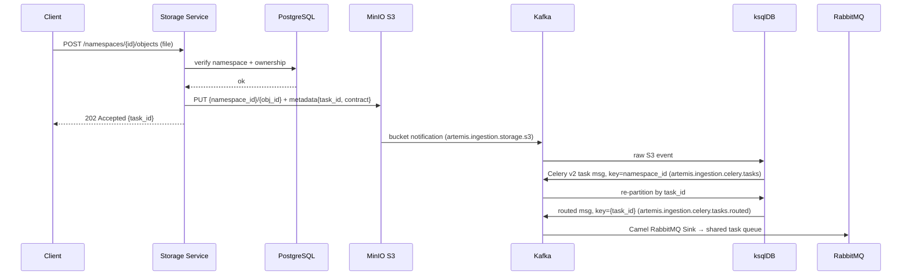

# Dispatch Subsystem

The dispatch subsystem accepts document operations from clients, writes files to object
storage, and fires the event that drives the downstream ingestion pipeline. It is the
boundary between the synchronous HTTP world and the async event-driven worker pipeline.

Every operation — upload, re-upload, or delete — resolves to a MinIO `PUT` that bakes an
`IngestionTaskDetails` contract into the object's S3 metadata. MinIO fires a bucket
notification to Kafka; ksqlDB reshapes it into a Celery task message and routes it to
RabbitMQ; the controller worker picks it up. The storage service returns `202 Accepted`
immediately with a `task_id` that the caller can use to poll for the eventual result.

---

## Components

<div align="center">



</div>

### Component Roles

**Storage Service** — FastAPI service and the single entry point for all dispatch
operations. Validates namespace ownership, derives stable object identity
(`obj_id = uuid5(namespace_id, filename)`), writes the file to MinIO with the ingestion
contract embedded as S3 metadata, and returns a `task_id`. Also exposes namespace
lifecycle endpoints and read-only observability views (object list, task status).

**MinIO S3** — object store and event source. Every `PUT` (file or tombstone) fires an
S3 bucket notification to Kafka with the full S3 event payload, including the metadata
fields the storage service embedded. The file bytes live here permanently; only the
contract metadata flows downstream.

**Kafka** — event backbone. Receives the raw S3 `PUT` notification on
`artemis.ingestion.storage.s3` and carries the reshaped Celery task messages between
ksqlDB CSAS steps.

**ksqlDB** — stateless stream processor. Two CSAS steps reshape and re-partition the
event: the first extracts the `IngestionTaskDetails` contract fields and builds a
Celery v2 task message, partitioned by `namespace_id` for per-namespace ordering; the
second re-partitions by `task_id` so the RabbitMQ sink can promote it as the AMQP
message id (which becomes the Celery task id that the controller worker reports back).

**RabbitMQ** — task broker. The Camel Spring RabbitMQ Sink Connector delivers the Celery
message to a single shared queue. The controller worker consumes from there — private
and enterprise objects are not distinguished at the queue level.

**PostgreSQL** — read-only for the storage service. The `ingested_objects` and
`ingestion_tasks` tables are written exclusively by a JDBC Sink Connector via CDC from
the Celery result backend — the storage service only queries them to serve the
observability endpoints.

---

## Dispatch Flow

### Upload (CREATE / MODIFY)



### Delete (tombstone)

Deletes follow the same event path. Instead of file bytes, the storage service writes a
0-byte object (`size=0`) with `upload_action=DELETE` in the contract metadata. MinIO
fires the same `PUT` notification; ksqlDB routes it identically; the controller worker
receives `tasks.ingest` with `upload_action=DELETE` and dispatches `delete_document`
instead of the parse → index chain.

Batch deletes (`DELETE /namespaces/{id}/objects?group_id=...` or
`DELETE /namespaces/{id}`) write one tombstone per object, each with its own `task_id`.

---

## Contract Embedding

The `IngestionTaskDetails` contract is serialised as JSON and stored in the S3 object
metadata field `X-Amz-Meta-Contract` on every `PUT`. ksqlDB extracts its fields from the
raw S3 event using `EXTRACTJSONFIELD` and assembles the Celery v2 `kwargs` payload
directly — no service call, no database read.

```
MinIO S3 PUT event (artemis.ingestion.storage.s3)
─────────────────────────────────────────────────────────────
Records[0].s3.bucket.name                       → "artemis"
Records[0].s3.object.userMetadata
  .X-Amz-Meta-Task_id                           → "<task_id>"
  .X-Amz-Meta-Contract                          → (JSON string) ─┐
    .upload_action                               → "CREATE"       │
    .s3.bucket                                  → "artemis"      │  EXTRACTJSONFIELD
    .s3.object                                  → "<ns>/<obj>"   │  in ksqlDB CSAS
    .s3.size                                    → <N>            │
    .source.source                              → "report.pdf"   │
    .source.content_type                        → "application/pdf"
    .source.obj_id                              → "<uuid>"       │
    .source.object_type                         → "file"         │
    .info.namespace_id                          → "<uuid>"       │
    .info.group_id                              → "<uuid|null>"  ─┘

                              │
                              ▼ ksqlDB CSAS: artemis-ingestion-celery-tasks
                                (partitioned by namespace_id)
                              │
                              ▼

Celery v2 task message (artemis.ingestion.celery.tasks.routed)
─────────────────────────────────────────────────────────────
{
  "task":   "tasks.ingest",
  "id":     "<task_id>",
  "kwargs": {
    "upload_action": "CREATE",
    "s3":     { "bucket": "artemis", "object": "<ns>/<obj>", "size": <N> },
    "source": { "source": "report.pdf", "content_type": "application/pdf",
                "obj_id": "<uuid>", "object_type": "file" },
    "info":   { "namespace_id": "<uuid>", "group_id": "<uuid|null>" }
  }
}
```

---

## Object Identity

`obj_id` is derived deterministically: `uuid5(namespace_id, filename)`. Re-uploading
the same filename to the same namespace produces the same `obj_id`, which lets the
indexing service's RecordManager skip unchanged content. The S3 key is always
`{namespace_id}/{obj_id}`.

---

## API

| Method | Path | Action | Returns |
|--------|------|--------|---------|
| `POST` | `/namespaces/{id}/objects` | Upload new file | `202 {task_id}` |
| `PUT` | `/namespaces/{id}/objects/{obj_id}` | Re-upload / update file | `202 {task_id}` |
| `DELETE` | `/namespaces/{id}/objects/{obj_id}` | Delete one object | `202` |
| `DELETE` | `/namespaces/{id}/objects?group_id=...` | Delete all objects in a group | `202 {task_ids[]}` |
| `GET` | `/namespaces/{id}/objects` | List ingested objects | `200 [...]` |
| `GET` | `/namespaces/{id}/tasks` | List task history | `200 [...]` |
| `GET` | `/namespaces/{id}/tasks/{task_id}` | Poll task status | `200 {status, ...}` |
| `POST` | `/namespaces` | Create namespace | `201` |
| `GET` | `/namespaces/{id}` | Get namespace | `200` |
| `PATCH` | `/namespaces/{id}` | Rename namespace | `200` |
| `DELETE` | `/namespaces/{id}` | Delete namespace + all objects | `202` |

All write endpoints return immediately. Task completion is observable only after the
worker finishes and the CDC pipeline fans the result out to `ingestion_tasks`.
