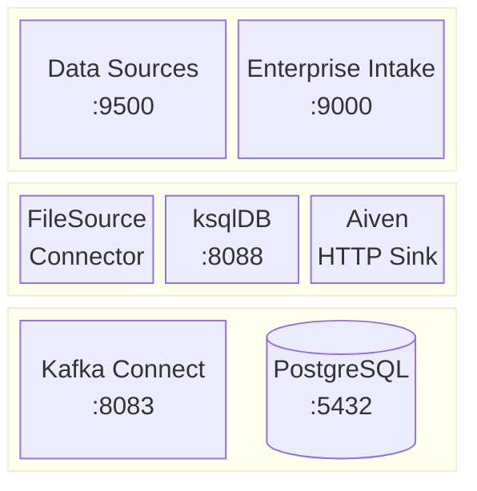
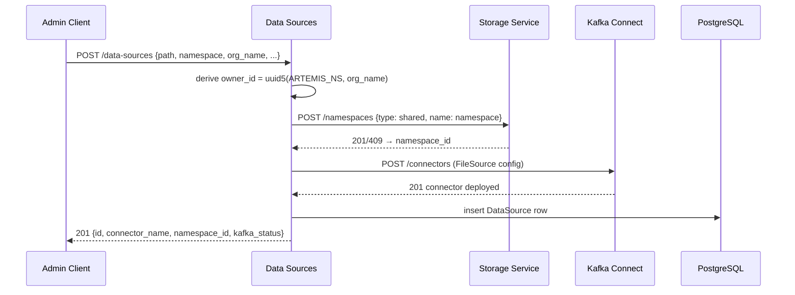
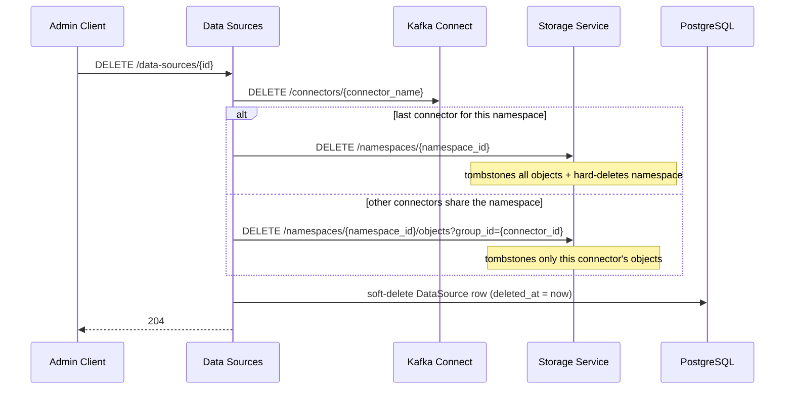
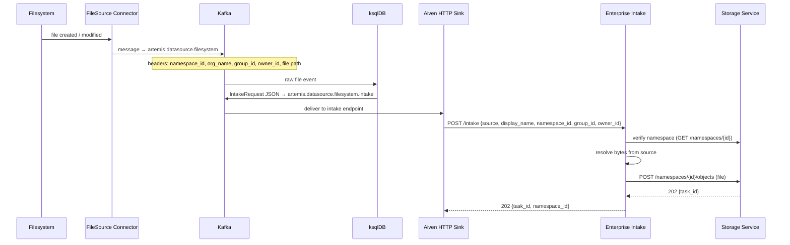

# Enterprise Subsystem

The enterprise subsystem ingests documents from organisation-owned filesystems rather than
direct client uploads. It consists of two services — the data sources control plane and
the intake service — built around Kafka Connect FileSource connectors. Once a file event
reaches the intake service it is forwarded to the storage service and enters the same
[dispatch pipeline](dispatch-subsystem.md) as any private upload.

---

## Components

### Component Roles

**Data Sources** — control plane for enterprise connector lifecycle. On `POST
/data-sources` it derives a stable `owner_id = uuid5(ARTEMIS_NS, org_name)`, upserts a
SHARED namespace on the storage service, deploys a Camel FileSource connector to Kafka
Connect, and persists a `DataSource` record to PostgreSQL. Also exposes pause / resume /
restart / delete lifecycle actions, each forwarded directly to the Kafka Connect REST API.

**Enterprise Intake** — stateless HTTP adapter. Receives `IntakeRequest` events from the
Aiven HTTP sink, resolves document bytes from the declared source type (filesystem path,
inline text, or URL), infers the MIME type, and proxies the file to the storage service
`POST /namespaces/{id}/objects`. Has no knowledge of MinIO, Kafka, Qdrant, or Celery —
it speaks only to the storage service.

**FileSource Connector** — Camel `CamelFileSourceConnector` deployed per data source.
Watches a mounted read-only filesystem path (`noop=true`, files are never moved or
deleted), emits a Kafka message per file to `artemis.datasource.filesystem`, and injects
ownership metadata (`namespace_id`, `org_name`, `group_id`, `owner_id`) as message
headers via SMT transforms.

**ksqlDB** — reshapes the raw file event into an `IntakeRequest` JSON body, promoting
Kafka headers to top-level JSON fields. Produces to `artemis.datasource.filesystem.intake`.

**Aiven HTTP Sink** — delivers the shaped `IntakeRequest` to `POST /intake` on the
enterprise intake service.

**Kafka Connect** — hosts all FileSource connector instances. Managed by the data sources
service via the Kafka Connect REST API.

**PostgreSQL** — stores `DataSource` rows (connector metadata: name, path, namespace,
org, connector_name). Written by the data sources service; never by the intake service.

---

## Connector Lifecycle

### Create

### Delete

Pause / resume / restart forward directly to the Kafka Connect REST API and return the
live connector status without touching PostgreSQL or the storage service.

---

## Ingestion Flow

Once deployed, a connector watches its path autonomously. Every new or modified file
triggers the following chain:

From the storage service `PUT` onward, the event follows the standard
[dispatch pipeline](dispatch-subsystem.md): MinIO bucket notification → Kafka → ksqlDB →
RabbitMQ → controller worker.

---

## Identity Model

| Concept | Derivation | Notes |
|---------|-----------|-------|
| `owner_id` | `uuid5(ARTEMIS_NS, org_name)` | Derived on every call; never persisted |
| `namespace_id` | Issued by storage service on namespace creation | Stable per namespace name + org |
| `group_id` | `DataSource.id` (connector record UUID) | Scopes objects per connector, enabling group-level deletion |
| `obj_id` | `uuid5(namespace_id, filename)` | Derived in storage service; same file = same obj_id |

`group_id = connector_id` is the key invariant for scoped deletion: when a connector is
removed, only the objects it produced are tombstoned (unless it was the last connector
for the namespace, in which case the whole namespace is wiped).

---

## Source Types

The intake service accepts three source types in `IntakeRequest`:

| Type | How bytes are resolved | Status |
|------|----------------------|--------|
| `filesystem` | Read from absolute path on the mounted volume | Implemented |
| `inline` | Encode `content` string with specified `encoding` (default UTF-8) | Not yet implemented |
| `url` | Fetch over HTTP; prefer `Content-Type` response header for MIME | Not yet implemented |

All three produce the same `(bytes, content_type)` pair before the storage service upload.

---

## API

### Data Sources (:9500)

| Method | Path | Action |
|--------|------|--------|
| `POST` | `/data-sources` | Deploy connector + upsert namespace |
| `GET` | `/data-sources` | List all data sources with live Kafka Connect status |
| `GET` | `/data-sources/{id}` | Get one data source |
| `DELETE` | `/data-sources/{id}` | Stop connector + tombstone objects |
| `DELETE` | `/data-sources/namespace/{namespace_id}` | Delete all connectors for a namespace |
| `POST` | `/data-sources/{id}/pause` | Pause connector |
| `POST` | `/data-sources/{id}/resume` | Resume connector |
| `POST` | `/data-sources/{id}/restart` | Restart connector tasks |

### Enterprise Intake (:9000)

| Method | Path | Action |
|--------|------|--------|
| `POST` | `/intake` | Resolve bytes + forward to storage service |
