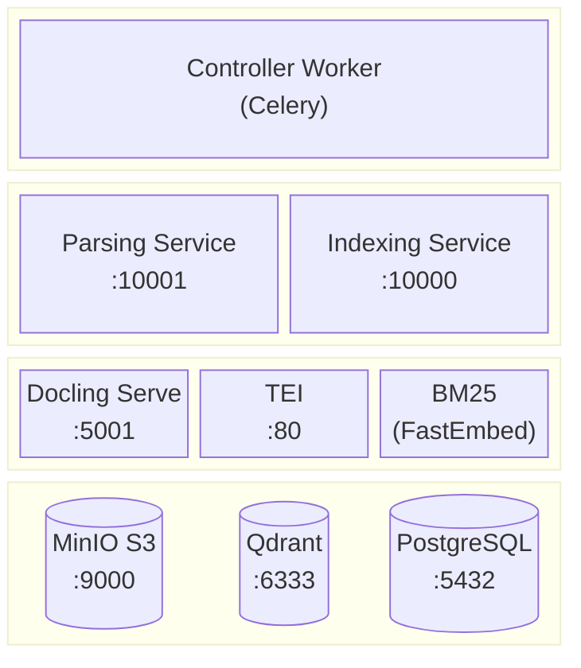
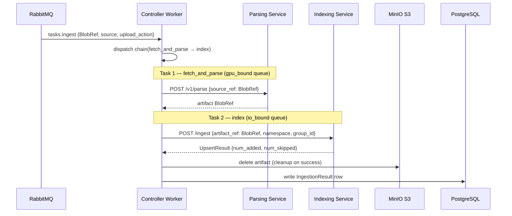
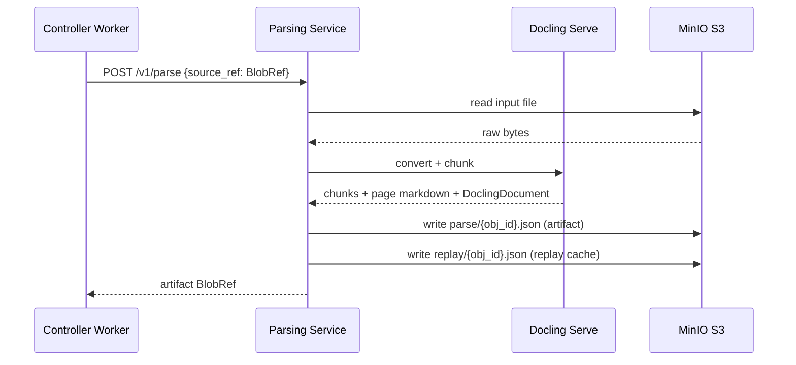
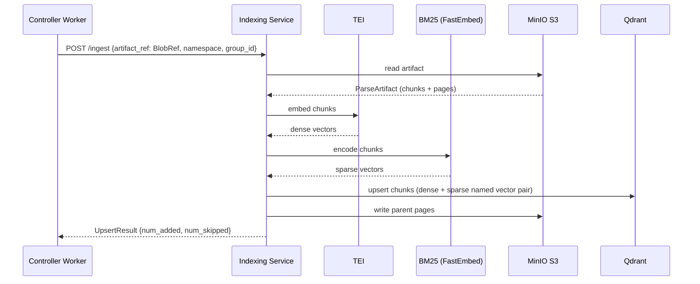

# Ingestion Subsystem

The ingestion subsystem converts a stored document into vector-searchable chunks. It is
triggered by the task queue and consists of three services — the controller worker, the
parsing service, and the indexing service — that hand work to each other via claim-check
references rather than raw bytes.

---

## Components

<div align="center">



</div>

### Component Roles

**Controller Worker** — Celery worker consuming from RabbitMQ. Owns the ingestion
orchestration: receives the `ingest` task from the task queue, dispatches the
`fetch_and_parse → index` chain, and writes final task results (success or structured
failure) to PostgreSQL via a custom result backend. Holds circuit breakers for both
downstream services.

**Parsing Service** — FastAPI service (`POST /v1/parse`) that converts a raw document
into a structured parse artifact. Accepts a `BlobRef` (claim-check); reads the input
file from MinIO, drives [Docling Serve](https://github.com/docling-project/docling-serve)
for document conversion and chunking, assembles a `ParseArtifact` (structured chunks +
page-level markdown), writes the artifact and a lossless replay cache to MinIO, and
returns only the artifact's `BlobRef`.

**Indexing Service** — FastAPI service (`POST /ingest`) that embeds and stores a parse
artifact. Accepts a `BlobRef` to the artifact; reads it from MinIO, embeds each chunk
via TEI, writes vectors to Qdrant, and caches parent-page markdown back to MinIO.
Deduplicates via LangChain RecordManager keyed by `obj_id`.

**[Docling Serve](https://github.com/docling-project/docling-serve)** — GPU-backed
document conversion service. Called by the parsing service to extract structured chunks
and full-page markdown from PDFs and other document formats.

**[TEI (Text Embeddings Inference)](https://github.com/huggingface/text-embeddings-inference)** — embeds each chunk into a dense vector using the same model used at query time, ensuring chunk and query vectors live in the same space.

**BM25 (FastEmbed)** — encodes each chunk as a sparse vector using the `Qdrant/bm25` model. Runs in-process inside the indexing service. Together with the TEI dense vector, the two representations are stored as a named vector pair in Qdrant, enabling hybrid retrieval at query time.

**MinIO S3** — holds the input file, the parse artifact (`parse/{obj_id}.json`), a
lossless replay cache (`replay/{obj_id}.json`), and the indexed parent-page markdown.

**Qdrant** — vector database. Receives embedded chunk vectors from the indexing service,
scoped by `namespace_id` and `group_id` metadata.

**PostgreSQL** — Celery result backend. Stores task metadata and final
`IngestionResult` / `FailureRecord` rows, which CDC (Debezium → ksqlDB) fans out to
the `ingestion_tasks` table.

---

## Task Chain

### High-Level Chain



### Parsing Service



### Indexing Service



---

## Claim-Check Pattern

Raw bytes never cross a task boundary or an inter-service HTTP body. Every handoff is a
`BlobRef {bucket, key}` — a small JSON pointer to the actual data in MinIO. Each service
reads directly from and writes directly to object storage.

```
Controller      →  POST /v1/parse    →  { source_ref: BlobRef }   (no bytes)
Parsing Service →  returns           →  { bucket, key }            (artifact ref)
Controller      →  POST /ingest      →  { artifact_ref: BlobRef }  (no bytes)
Indexing Service → reads artifact    →  directly from MinIO
```

This keeps the Celery result backend lean (only small JSON results), avoids copying
multi-MB PDFs through the broker, and enables artifact replay on failure.

---

## Resilience

### Circuit Breakers

The controller worker holds two module-level circuit breakers (state shared across all
task invocations within a worker process):

| Breaker | Target | fail_max | reset_timeout |
|---------|--------|----------|---------------|
| `parsing_breaker` | Parsing Service | 3 | 120 s |
| `indexing_breaker` | Indexing Service | 3 | 120 s |

When OPEN, the breaker raises `CircuitBreakerError` immediately — no network call is
made, keeping worker threads available instead of blocking on a dead connection.

### Retry Strategy

Both `fetch_and_parse` and `index` follow the same retry policy:

| Error | Action |
|-------|--------|
| `CircuitBreakerError` | Retry after `reset_timeout + 5s + jitter(0–25%)`, max 20 retries |
| `HTTPStatusError` 5xx | Exponential backoff `min(120, 2^n)s + jitter`, max 20 retries |
| `HTTPStatusError` 4xx | Permanent failure — not retried |
| `EmptyObjectError` | Permanent failure — not retried |

### Artifact Lifecycle

The parse artifact is deleted by the controller only after a successful index. On any
failure the artifact is left in place in MinIO, allowing the task to be retried (or
replayed manually) without re-parsing the document.

---

## Deletion

Two deletion paths exist alongside the ingestion chain:

| Task | Trigger | Effect |
|------|---------|--------|
| `tasks.delete_document` | `DELETE` / `AUTO_DELETE` upload action | Removes all Qdrant vectors + RecordManager entries for one `obj_id`; deletes its cached parent pages |
| `tasks.delete_namespace` | Namespace tombstone | Full namespace wipe — removes all objects tracked under `namespace_id` from Qdrant and the page store |

---

## Deduplication

The indexing service uses LangChain's `RecordManager` to skip unchanged content. Chunks
are keyed by `obj_id = uuid5(namespace_id, source_path)`. Re-uploading the same file
to the same namespace is a no-op for unchanged chunks (`num_skipped` is non-zero,
`num_added` is zero).
