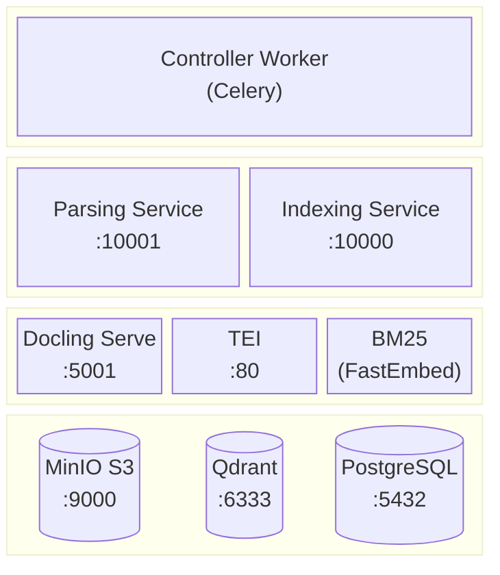
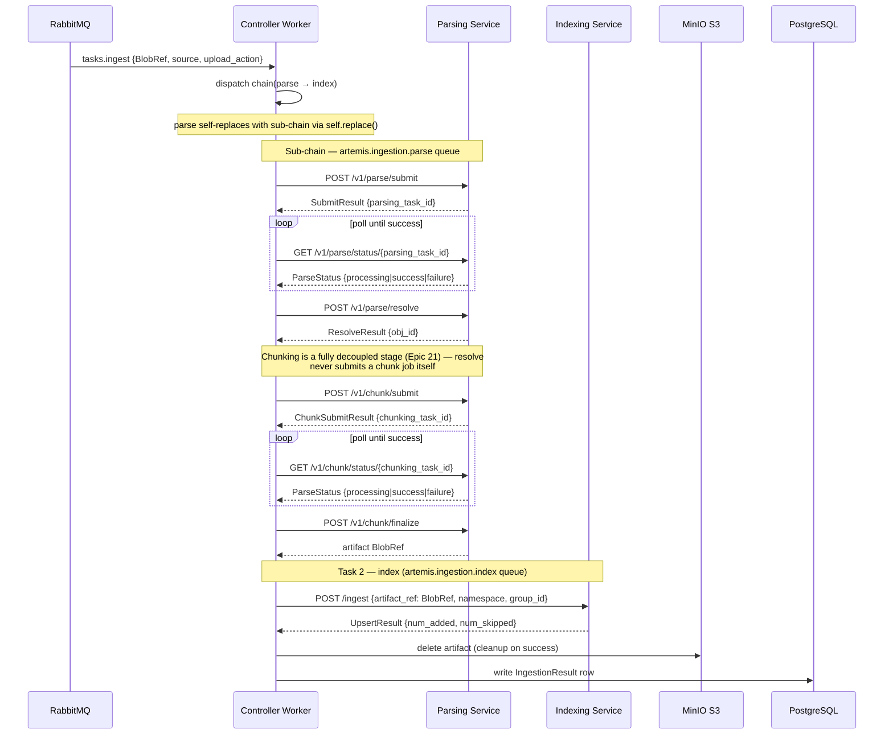
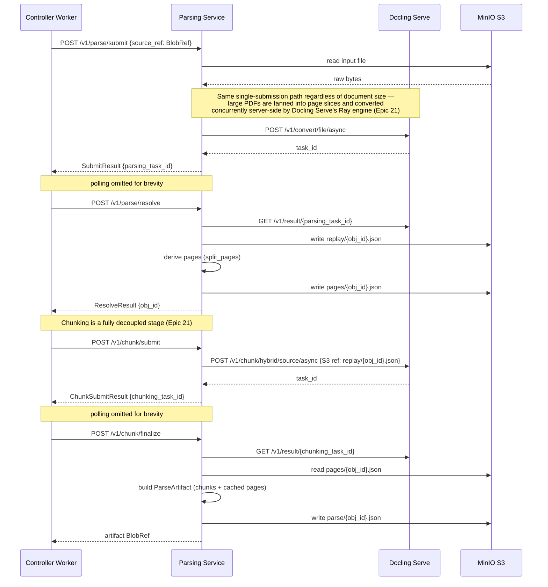
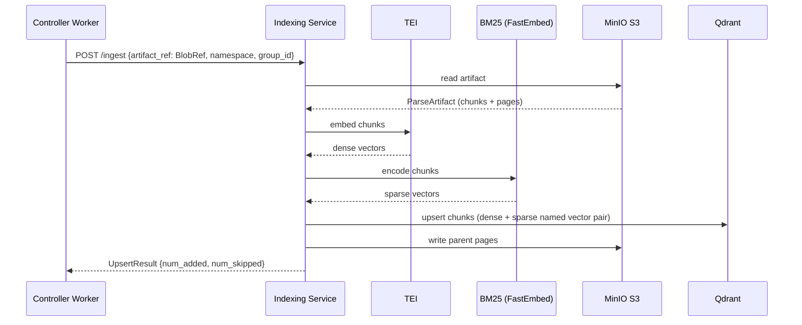

# Ingestion Subsystem

The ingestion subsystem converts a stored document into vector-searchable chunks. It is
triggered by the task queue and consists of three services — the controller worker, the
parsing service, and the indexing service — that hand work to each other via claim-check
references rather than raw bytes.

---

## Components

<div align="center">



</div>

### Component Roles

**Controller Worker** — Celery worker consuming from RabbitMQ. Owns the ingestion
orchestration: receives the `ingest` task from the task queue, dispatches the
`parse → index` chain (where `parse` self-replaces with a five-task async sub-chain),
and writes final task results (success or structured failure) to PostgreSQL via a custom
result backend. Holds circuit breakers for both downstream services.

**Parsing Service** — FastAPI service that converts a raw document into a structured parse
artifact via an async submit/poll/resolve pipeline, followed by a fully decoupled
chunk submit/poll/finalize pipeline (Epic 21 — chunking is orchestrated as its own stage,
not bundled into conversion). Accepts a `BlobRef` (claim-check), submits a single async
conversion to [Docling Serve](https://github.com/docling-project/docling-serve) regardless
of document size — large PDFs are fanned out into page slices and converted concurrently
server-side by Docling Serve's Ray engine (see TODOs.md Epic 21), not by this service —
polls until complete, downloads and caches the result (replay JSON + derived pages), then
separately submits a chunk job, polls it, and writes the `ParseArtifact` and a lossless
replay cache to MinIO. Returns only the artifact's `BlobRef`. Remains the sole place in
Artemis that imports Docling types or knows docling-serve's API surface.

**Indexing Service** — FastAPI service (`POST /ingest`) that embeds and stores a parse
artifact. Accepts a `BlobRef` to the artifact; reads it from MinIO, embeds each chunk
via TEI, writes vectors to Qdrant, and caches parent-page markdown back to MinIO.
Deduplicates via LangChain RecordManager keyed by `obj_id`.

**[Docling Serve](https://github.com/docling-project/docling-serve)** — document conversion
service, GPU-accelerated in dev and release, CPU-only in test. Called by the parsing service to
extract structured chunks and full-page markdown from PDFs and other document formats. Ray-backed
in all three compose modes (server-side page-slice fan-out for large PDFs — see TODOs.md Epic 21);
release was promoted ahead of a large-PDF memory-bounding proof on an explicit risk-acceptance call.

**[TEI (Text Embeddings Inference)](https://github.com/huggingface/text-embeddings-inference)** — embeds each chunk into a dense vector using the same model used at query time, ensuring chunk and query vectors live in the same space.

**BM25 (FastEmbed)** — encodes each chunk as a sparse vector using the `Qdrant/bm25` model. Runs in-process inside the indexing service. Together with the TEI dense vector, the two representations are stored as a named vector pair in Qdrant, enabling hybrid retrieval at query time.

**MinIO S3** — holds the input file, the parse artifact (`parse/{obj_id}.json`), a
lossless replay cache (`replay/{obj_id}.json`), and the indexed parent-page markdown.

**Qdrant** — vector database. Receives embedded chunk vectors from the indexing service,
scoped by `namespace_id` and `group_id` metadata.

**PostgreSQL** — Celery result backend. Stores task metadata and final
`IngestionResult` / `FailureRecord` rows, which CDC (Debezium → ksqlDB) fans out to
the `ingestion_tasks` table.

---

## Task Routing

The controller worker declares two durable RabbitMQ queues with different scaling profiles:

| Queue | Worker | Concurrency | Tasks | Scale driver |
|-------|--------|-------------|-------|--------------|
| `artemis.ingestion.parse` | `backend-controller-parse-worker` | 3 | `tasks.ingest`, `tasks.parse`, `tasks.submit_parse`, `tasks.poll_parse`, `tasks.resolve_parse`, `tasks.submit_chunk`, `tasks.poll_chunk` | HTTP (Docling Serve async API) |
| `artemis.ingestion.index` | `backend-controller-index-worker` | 1 | `tasks.index`, `tasks.delete_document`, `tasks.delete_namespace` | I/O (TEI + Qdrant + Postgres) |

`tasks.ingest` (entry point dispatched by the RabbitMQ sink) lands on the `parse` queue
so chain dispatch is co-located with the first parse task. Parse worker threads are never
blocked for the duration of a Docling job — each thread either makes a single short HTTP
call or sleeps in `self.retry()`. The `index` queue remains serial (`concurrency=1`)
because the indexing service drives the GPU-bound TEI embedding model.

Both queues share the same RabbitMQ exchange (`artemis.ingestion`, direct type).

---

## Task Chain

### High-Level Chain



### Parsing Service



### Indexing Service



---

## Claim-Check Pattern

Raw bytes never cross a task boundary or an inter-service HTTP body. Every handoff is a
`BlobRef {bucket, key}` — a small JSON pointer to the actual data in MinIO. Each service
reads directly from and writes directly to object storage.

```
Controller      →  POST /v1/parse    →  { source_ref: BlobRef }   (no bytes)
Parsing Service →  returns           →  { bucket, key }            (artifact ref)
Controller      →  POST /ingest      →  { artifact_ref: BlobRef }  (no bytes)
Indexing Service → reads artifact    →  directly from MinIO
```

This keeps the Celery result backend lean (only small JSON results), avoids copying
multi-MB PDFs through the broker, and enables artifact replay on failure.

---

## Resilience

### Circuit Breakers

The controller worker holds two module-level circuit breakers (state shared across all
task invocations within a worker process):

| Breaker | Target | fail_max | reset_timeout |
|---------|--------|----------|---------------|
| `parsing_breaker` | Parsing Service | 3 | 120 s |
| `indexing_breaker` | Indexing Service | 3 | 120 s |

When OPEN, the breaker raises `CircuitBreakerError` immediately — no network call is
made, keeping worker threads available instead of blocking on a dead connection.

### Retry Strategy

All parse sub-tasks and `index` follow the same retry policy:

| Error | Action |
|-------|--------|
| `CircuitBreakerError` | Retry after `reset_timeout + 5s + jitter(0–25%)`, max 20 retries |
| `HTTPStatusError` 5xx | Exponential backoff `min(120, 2^n)s + jitter`, max 20 retries |
| `HTTPStatusError` 4xx | Permanent failure — not retried |
| `EmptyObjectError` | Permanent failure — not retried |

### Artifact Lifecycle

The parse artifact is deleted by the controller only after a successful index. On any
failure the artifact is left in place in MinIO, allowing the task to be retried (or
replayed manually) without re-parsing the document.

---

## Deletion

Two deletion paths exist alongside the ingestion chain:

| Task | Trigger | Effect |
|------|---------|--------|
| `tasks.delete_document` | `DELETE` / `AUTO_DELETE` upload action | Removes all Qdrant vectors + RecordManager entries for one `obj_id`; deletes its cached parent pages |
| `tasks.delete_namespace` | Namespace tombstone | Full namespace wipe — removes all objects tracked under `namespace_id` from Qdrant and the page store |

---

## Deduplication

The indexing service uses LangChain's `RecordManager` to skip unchanged content. Chunks
are keyed by `obj_id = uuid5(namespace_id, source_path)`. Re-uploading the same file
to the same namespace is a no-op for unchanged chunks (`num_skipped` is non-zero,
`num_added` is zero).
