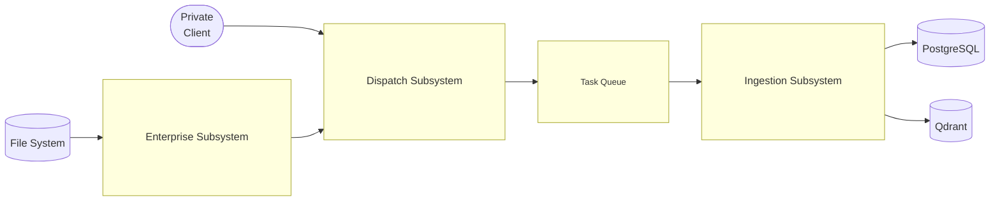
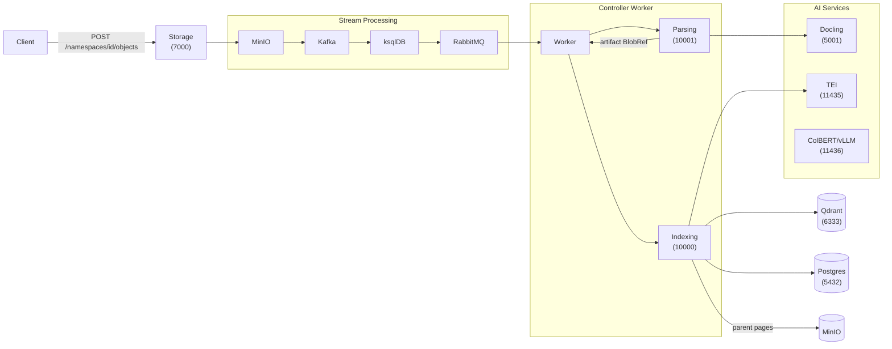
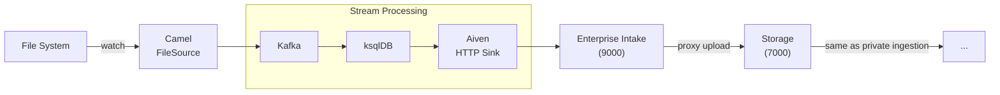
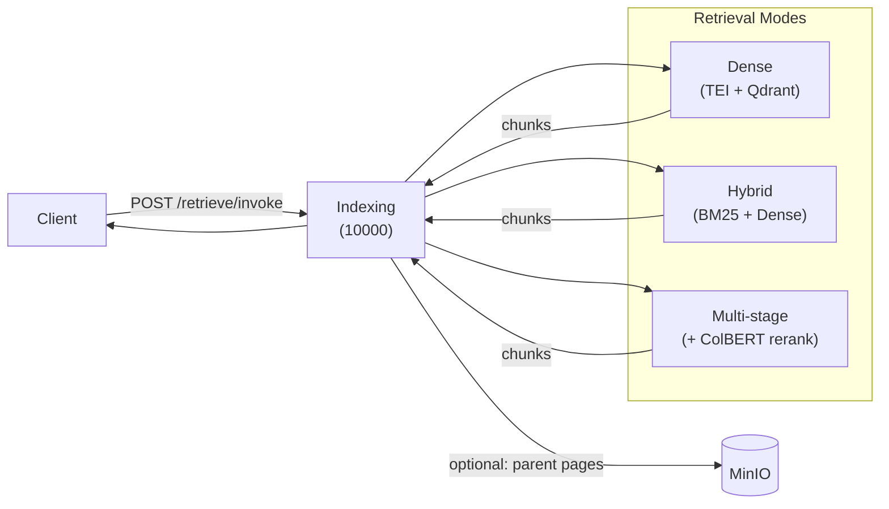

# Architecture Overview

Artemis is a RAG document ingestion system. Its job is to accept files (via REST upload or
enterprise filesystem/connector sources), parse them into structured chunks, embed them into
a vector store, and serve semantic search queries. The system is event-driven: a file upload
triggers a Kafka notification, which flows through a stream-processing layer into an async
Celery task chain that handles parsing and indexing independently.

---

## System Overview



---

## Private Ingestion



The storage service writes the uploaded file to MinIO and records metadata in Postgres.
MinIO emits a Kafka notification. ksqlDB reshapes it into a Celery task message and routes
it to RabbitMQ. The controller worker calls the parsing service (which drives Docling),
receives a `BlobRef` to the parse artifact, then calls the indexing service which embeds
chunks via TEI and writes vectors to Qdrant. The CDC pipeline propagates the final task
result back to `ingested_objects` and `ingestion_tasks`.

See [Ingestion Walkthrough](../guides/ingestion-walkthrough.md) for a step-by-step trace.

---

## Enterprise Ingestion



A Kafka Connect source connector (e.g. Camel FileWatch) monitors a directory. When a new
file appears, it emits an event carrying file path and ownership headers. ksqlDB reshapes
this into an `IntakeRequest` and the Aiven HTTP sink delivers it to the enterprise intake
service. The intake service reads the file bytes from disk and proxies the upload to the
storage service, joining the private ingestion pipeline from there.

---

## Retrieval



A client sends a query to `/retrieve/invoke`. The indexing service embeds the query with
TEI, queries Qdrant (dense, hybrid BM25+dense, or multi-stage with ColBERT reranking
depending on `RETRIEVAL_MODE`), and optionally dereferences chunk `parent_id` keys to
return full page text from the MinIO doc store.

See [Retrieval Modes](../guides/retrieval-modes.md) for configuration and trade-offs.

---

## Service Port Table

| Service | Port | Type |
|---------|------|------|
| Storage service | 7000 | FastAPI HTTP |
| Enterprise intake | 9000 | FastAPI HTTP |
| Indexing service | 10000 | FastAPI HTTP (LangServe) |
| Parsing service | 10001 | FastAPI HTTP |
| Enterprise data sources | 9500 | FastAPI HTTP |
| MCP server | 11000 | FastAPI + MCP streamable HTTP |
| Controller worker | — | Celery (no HTTP surface) |
| MinIO API | 9000 | S3-compatible |
| MinIO console | 9090 | Web UI |
| PostgreSQL | 5432 | Postgres wire protocol |
| Qdrant | 6333 | HTTP + gRPC |
| RabbitMQ broker | 5672 | AMQP |
| RabbitMQ management | 15672 | Web UI |
| Kafka broker (internal) | 9092 | Kafka protocol |
| Kafka broker (external) | 19092 | Kafka protocol |
| Schema Registry | 8081 | HTTP |
| Kafka Connect | 8083 | HTTP |
| ksqlDB | 8088 | HTTP |
| TEI (internal) | 80 | HTTP |
| TEI (host) | 11435 | HTTP |
| Docling Serve | 5001 | HTTP |
| ColBERT/vLLM (internal) | 8000 | HTTP |
| ColBERT/vLLM (host) | 11436 | HTTP |
| APISIX proxy | 9080 | HTTP |
| APISIX admin | 9180 | HTTP |

---

## Docker Compose Profiles

| Profile | Contents | When to use |
|---------|----------|-------------|
| `infra` | PostgreSQL, MinIO, Qdrant, RabbitMQ, Kafka, Schema Registry, `artemis-db-migrations` | Always — foundational data layer |
| `backend` | Storage, Parsing, Indexing, Controller Worker, ksqlDB, `artemis-ksqldb-init` | Core ingestion and retrieval |
| `enterprise` | Kafka Connect, Enterprise Intake, Enterprise Data Sources, `artemis-kafka-connect-init`, `ksqldb-enterprise-init` | Enterprise connector ingestion |
| `ai` | Docling Serve (GPU) | Document parsing |
| `ai-tei` | TEI (HuggingFace text embeddings) | Dense embedding |
| `ai-colbert` | vLLM + ColBERT model | Multi-stage reranking |
| `gateway` | APISIX, etcd, `artemis-apisix-init` | API gateway routing |
| `observability` | OTel Collector, Jaeger, Prometheus | Distributed tracing and metrics |
| `dev-tools` | pgAdmin, Kafka UI, ksqlDB CLI | Local development tooling |

**Common combinations:**

```bash
# Minimal private ingestion + retrieval
docker compose --profile infra --profile backend --profile ai --profile ai-tei up

# Full enterprise stack
docker compose --profile infra --profile backend --profile enterprise \
               --profile ai --profile ai-tei --profile gateway up

# With observability
docker compose --profile infra --profile backend --profile ai --profile ai-tei \
               --profile observability up
```

See [Deployment Guide](../guides/deployment.md) for startup order and env vars.

---

## Key Cross-Cutting Concerns

- **Multi-tenancy**: every object is scoped by `namespace_id`; see [Tenancy](tenancy.md)
- **Claim-check pattern**: large payloads never cross service boundaries as bytes — services
  exchange `BlobRef {bucket, key}` and read/write directly to MinIO
- **Deduplication**: LangChain RecordManager keyed by `obj_id = uuid5(namespace_id, source)` —
  re-uploading the same file skips re-embedding unchanged content
- **Observability**: OTel SDK in every service; `artemis.task_id` span attribute links all
  spans in an ingestion round trip; Jaeger UI on port 16686 (observability profile)
