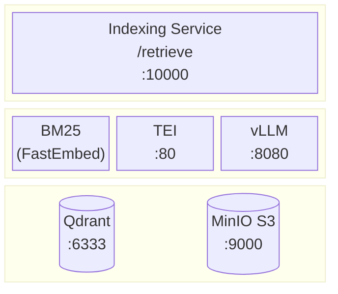
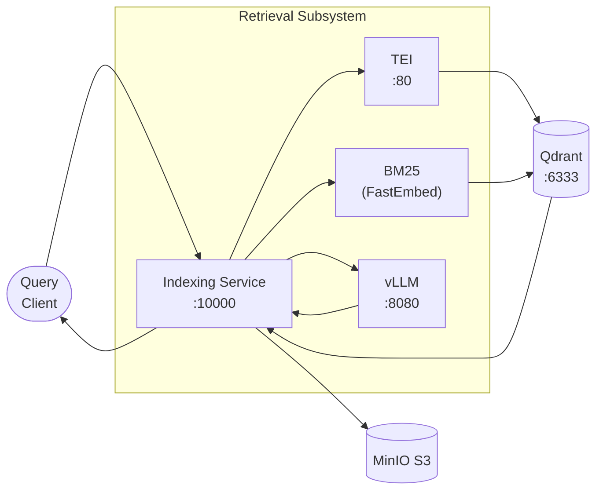
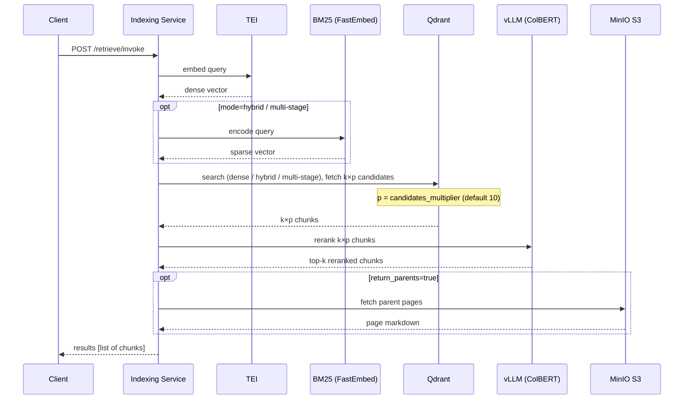

# Retrieval Subsystem

The retrieval subsystem answers semantic search queries against indexed documents. It is
exposed through a single endpoint on the indexing service and composes TEI embeddings,
Qdrant vector search + optional keyword search, reranking, and optional parent-page resolution
from storage (S3) into a unified query pipeline.

---

## Components

<div align="center">



</div>

### Component Roles

**Indexing Service** — query entry point. Orchestrates the full retrieval pipeline: embeds the query, dipatches the retrieval algorithm based on respective indexing method (simple/semi-structured etc.), dispatches to Qdrant, reranks results, and optionally resolves parent pages. Exposes a single LangServe-compatible endpoint (`POST /retrieve/invoke`).

**[TEI (Text Embeddings Inference)](https://github.com/huggingface/text-embeddings-inference)** — embeds the natural-language query into a dense vector using the same model used at indexing time, ensuring query and chunk vectors live in the same space.

**BM25 (FastEmbed)** — encodes the query as a sparse vector using the `Qdrant/bm25` model. Runs in-process inside the indexing service. Active only in `hybrid` and `multi_stage` modes.

**[Qdrant](https://qdrant.tech)** — vector database. Executes the search (cosine similarity for dense, RRF fusion for hybrid) and returns the top candidates. Scoped per-request by `namespace_id` filter.

**[vLLM](https://github.com/vllm-project/vllm) (late interaction reranker)** — Hosts the reranking model. Receives the oversized candidate set (`k×p`) and returns only the top `k`.

**MinIO S3** — object store holding full page-level markdown. Consulted only when `return_parents=true` to dereference chunk `parent_id` pointers to their source page.

<div align="center">



</div>

---

## Call Flow



---

## Retrieval Modes

Four modes compose orthogonally with the pipeline type:

| Mode | Description |
|------|-------------|
| `dense` | TEI embed → Qdrant cosine similarity. Default. |
| `hybrid` | TEI dense + FastEmbed BM25 sparse → Qdrant RRF fusion. Better keyword recall. |
| `multi_stage` | Hybrid prefetch → late interaction rerank. Highest precision, GPU required. **Not currently used** — late interaction models store an N×128 token-level matrix per chunk, making per-chunk storage proportional to token count and impractical at scale. |
| `parent_page` | Flag on any mode. Resolves chunk `parent_id` → full page markdown from MinIO. |

See [Retrieval Modes](../guides/retrieval-modes.md) for configuration, collection schemas,
and request format details.

---

## API


Accepts a natural-language query and a `configurable` block specifying `namespace_id`,
`k` (number of results), and `return_parents`. Returns a list of chunks or pages with metadata:

```bash
curl -X POST http://localhost:10000/retrieve/invoke \
  -H "Content-Type: application/json" \
  -d '{
    "input": "what are the data retention policies?",
    "config": {
      "configurable": {
        "namespace_id": "3f2a1b4c-...",
        "k": 5,
        "return_parents": false
      }
    }
  }'
```

The [MCP server](../services/mcp.md) wraps this endpoint as the `retrieve` tool for AI
clients.
